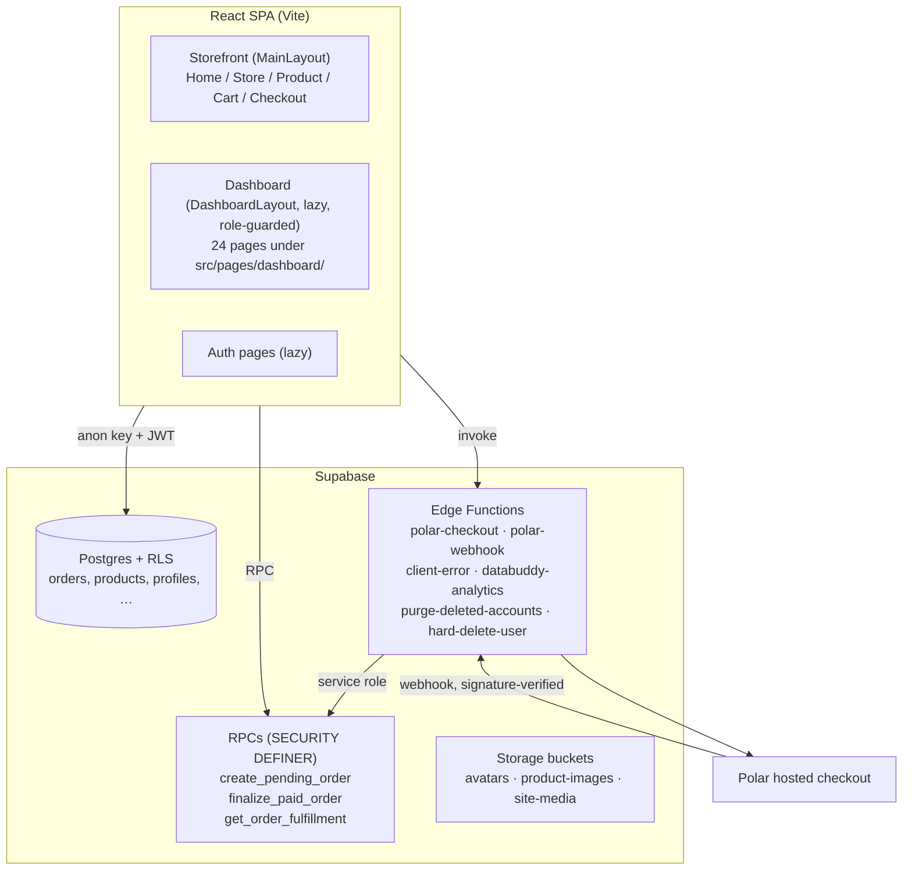
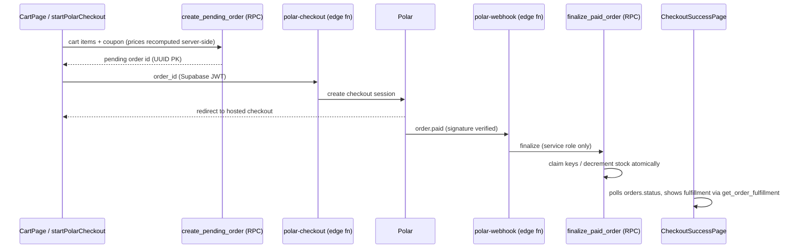

<p align="center">
  
</p>

<p align="center">
  <a href="https://github.com/Tmezjbn/HevenStore/actions/workflows/ci.yml"></a>
  
  
  
  
  
</p>

<p align="center">
  <a href="https://heven.fun"><strong>heven.fun</strong></a>
</p>

# HEVEN.FUN

**Purpose:** Human entry doc — what this repo is, how to run it, where money and ops truth live.

**Read this when:** onboarding, setting up a machine, or finding the right deeper doc.

Bilingual (AR/EN) digital storefront for games, subscriptions, gift cards, and one-time keys — plus a role-guarded dashboard (catalog, orders, users, support desk, badges, themes, website builder).

**Stack:** Vite + React 18 + TypeScript · Tailwind CSS 4 + DaisyUI 5 · Zustand (cart/wishlist/auth/appearance) · TanStack React Query (catalog) · Supabase (Postgres + RLS, Auth, Storage, Edge Functions) · Polar (payments) · Databuddy (consent-gated analytics).

## Quick start

```powershell
npm install
copy .env.example .env   # fill VITE_SUPABASE_URL + VITE_SUPABASE_ANON_KEY
npm run dev
```

Open http://localhost:5173. `VITE_SITE_URL` sets the origin used for canonicals: currently the staging origin (`https://heven.pages.dev`), switching to the production domain (`https://heven.fun`) at launch. Keep Edge `SITE_URL` on the same origin as the SPA build.

## Scripts

| Command | What |
|---------|------|
| `npm run dev` | Vite dev server |
| `npm run build` | Project refs typecheck + sitemap + Vite build + prerender |
| `npm run typecheck` | `tsc --noEmit` |
| `npm run lint` | ESLint (flat config) |
| `npm test` | Runs **every** `scripts/check-*.mjs` (**80** checks; all MUST pass) |
| `npm run preview` | Serve `dist/` |

PowerShell: chain with `;` — `&&` does not work here.

## Architecture



### Checkout flow (server-authoritative)



Human-readable `orders.order_number` (`ORD-YYYYMMDD-########`) is assigned by a DB trigger; Polar/webhooks/deep links still use UUID `orders.id`. Details: `HANDOFF.md`.

### Project map

| Area | Location |
|------|----------|
| Routes + providers | `src/App.tsx` |
| Storefront pages | `src/pages/` (catalog = `GamesPage` + `types` prop) |
| Dashboard pages | `src/pages/dashboard/` (**24** pages) |
| Shared UI | `src/components/ui/` |
| State | `src/stores/` |
| Domain helpers | `src/lib/` |
| Catalog hooks | `src/hooks/useCatalog.ts`, `useSiteSettings.ts`, `usePageMeta.ts` |
| SQL / RLS / RPCs | `supabase/migrations/` (**134** files) |
| Edge functions | `supabase/functions/` (6 fns + `_shared`) |
| Invariant checks | `scripts/check-*.mjs` (**80**; via `npm test`) |

**Roles:** `owner | admin | moderator | support | seller | buyer | member` — see `HANDOFF.md` (moderator ≠ product staff; `support` = ticket desk).

## Environment

See `.env.example`. Client-safe vars are `VITE_*` only. Server secrets (Polar tokens, Databuddy API key, purge cron secret) live in **Supabase Edge Function secrets** — never in Vite. Payment setup: [POLAR_SETUP.md](./POLAR_SETUP.md).

## Deploy

1. Apply Supabase migrations (`supabase db push` or SQL editor) — checkout RPCs and RLS are required.
2. Deploy edge functions: `polar-checkout`, `polar-webhook` (`--no-verify-jwt`), `client-error` (`--no-verify-jwt`), `purge-deleted-accounts` (`--no-verify-jwt`), `hard-delete-user`, optional `databuddy-analytics`. JWT posture is also pinned in `supabase/config.toml` — a flag-less deploy leaves `polar-webhook`/`client-error`/`purge-deleted-accounts` unreachable (401).
3. Build the SPA (`npm run build`) and host `dist/` behind HTTPS. Build needs `VITE_SUPABASE_URL` + `VITE_SUPABASE_ANON_KEY` for product HTML shells; without them, static routes still prerender.
4. Security headers: `public/_headers` (Netlify / Cloudflare Pages), `vercel.json` (Vercel), or the same set on your reverse proxy. SPA rewrite: `public/_redirects` (`/* /index.html 200`).
5. Set `VITE_SITE_URL` to the production origin for canonicals.
6. Point Polar webhook + Edge `SITE_URL` at that origin.
7. **Ops:** alerts, uptime, backup/PITR — **[OPS.md](./OPS.md)**. Live apply state is not verifiable from git.

## Docs map

| Doc | Use |
|-----|-----|
| **[HANDOFF.md](./HANDOFF.md)** | Invariants, roles, gotchas, verify, open items. **Read before checkout/auth/fulfillment.** |
| **[OPS.md](./OPS.md)** | Alerts, uptime, PITR, launch checklist (live-only items). |
| **[POLAR_SETUP.md](./POLAR_SETUP.md)** | Sandbox/prod Polar wiring. |
| **[PRODUCT.md](./PRODUCT.md)** + **[DESIGN.md](./DESIGN.md)** | Brand + UI rules before UI work. |
| **[AGENTS.md](./AGENTS.md)** | Short AI read-order. |

## Invariants (do not regress)

Orders, prices, coupons, and stock are server-authoritative (`create_pending_order` / `finalize_paid_order`). The client MUST NOT write `orders` / `order_items` / `coupon_usages`. Fulfillment secrets only via `get_order_fulfillment`. Full list + enforcement: `HANDOFF.md` + `scripts/check-checkout-authority.mjs`.

---

**Last verified:** 2026-07-24  
**How to update this doc:** Keep README as the map. Put deep invariants in HANDOFF; ops/live checks in OPS. Re-count checks/pages/migrations when those folders change.
